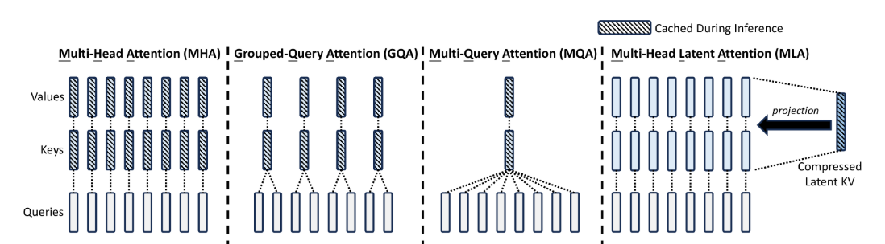
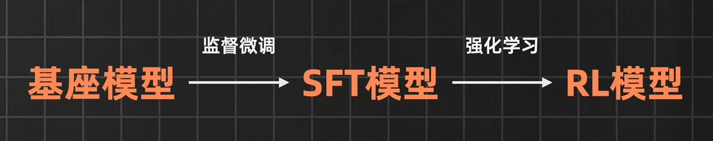
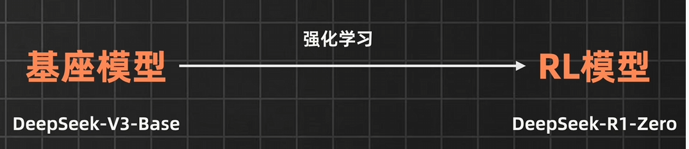

## DeepSeek

让 DeepSeek 热度暴涨的是 在 2025 年 1月20 日 发布的 [DeepSeek R1][DeepSeek R1] , 

R1 是推理模型 , 对标的是 OpenAI 的 o1 ;

V3 是通用模型 , 对标的是 OpenAI 的 4o ;

在 [DeepSeek 官网][DeepSeek 官网] 上可以与 R1 进行对话 , 点击 `深度思考R1` 便是与 R1 模型对话 , 若不点击 , 则默认是  V3 模型

### 直接展示了推理过程

OpenAI 的 o1 , 不但隐藏了 模型思考的过程 , 甚至是提及 **推理痕迹** 或 Cot (Chain-of-Thought , 思维链) 等词 都有可能导致 封号

DeepSeek R1 的推理会包含大量的反思 和 验证 , 我们在与模型对话时 , 甚至不需要额外引导模型 , 有时还能从模型的思考中学习 . 

### 免费使用 

OpenAI 的收费比较高 ,  $20 / 月 , 对 o1 和 o1-mini 的访问次数有限 ; $200/月 才能实现无限访问 ;

DeepSeek 这边直接可以在 App 或 网页上实现免费访问 R1

### 可联网

在使用 OpenAI 的 o1 时 , 是无法使用联网搜索的 , 但是不联网 , 大模型是拿不到实时的资讯 , 因此想问有时效性的问题时候 , 就不能指望 o1 了.

DeepSeek 允许 同时开启 深度思考 和 联网搜索 , 这样可以让 R1 模型结合完善最新的信息进行深度推理

### 成本低

官方没有公开 R1 的训练成本 , 但是很多人会以 V3 为例子 , 它的训练成本是 500W美元 , 而对标的 GPT4 的成本是 10亿美元 ; 并且国产大模型的第一枪 , 也是 DeepSeek 打响的 , 去年的 DeepSeek-V2 发布后 , 国内的 字节 , 阿里 , 百度 等大厂迅速跟进降价 

> 性价比比肩最前沿的大模型的同时 成本优势碾压海内外各大厂

### 架构创新

DeepSeek 从 V2 开始 , 就独创了一种全新的 [MLA][DeepSeek V3 MLA] (Multi-head Latent Attention)(多头潜在注意力) 架构 , 他魔改了传统的多头注意力 , 把键和值压缩成一个低秩潜在向量 , 来减少内存占用和计算开销 . 梁文峰说到 , 这个创新他们是单独成立了一个 Team 跑了几个月才跑通的 . 但是可贵的不只是这个创新结果本身 , 而是 DeepSeek 对于创新的选择 , 因为创新是不一定能做成的 , 其次是做成后 很容易让追随者躺平 .

### 训练创新

DeepSeek 在 R1 的训练上也做出了流程上的创新尝试 

#### 传统模型训练过程 : 

整个过程可以简化为 : 原始文本数据→基座模型→SFT数据→SFT模型→人类反馈→RL模型

这个训练过程被称为"对齐"（Alignment），目的是让AI模型的行为更好地对齐人类的价值观和期望。每一步都在让模型的输出更接近人类期望的结果，从而产出更实用、更安全的AI系统。

- 首先通过海量的文本数据 , 进行 **无监督** (文本没有标注) 学习 , 训练的目标是 预测下一个词 (Autoregressive Model , 自回归语言建模) , 以此得到一个基座模型 , 典型的例子是 GPT-3 的预训练阶段 . 
- 通过监督微调 (Supervised Fine-tuning , SFT) 使用高质量的人工标注数据 , 进行监督训练 , 数据通常是 `指令` -> `回答` , 即我们给模型问题和期望的答案 , 让模型先照着范本学习 ; 目的是让模型学会按照人类的意图来回答问题 , 这个阶段可以显著提升模型的 可用性 和 对话能力 , 以此得到一个 SFT模型
- 强化学习(Reinforcement Learning from Human Feedback , RLHF) 基于人类反馈的强化学习 , 这儿可以理解为我们让模型自己行动 , 通过打分来告诉它做的好还是差 , 让模型从反馈中学习 . 可以通过人工打分 或 通过 奖励模型 (Reward Model) 来打分 . 这儿主要包含三个步骤 
  - 搜集人类对模型回答的偏好数据 . 
  - 训练奖励模型 .
  - 使用 PPO (Proximal Policy Optimization , 近端策略优化) 等强化学习算法优化模型的输出 . 
- 整个强化学习主要是让模型生成更符合人类偏好的回答 , 最终产出 RL模型 , 也就是可以部署使用的模型 .

#### DeepSeek-LLM 训练过程

R1-Zero : 基座模型 -> DPO -> 完成
R1 : 基座模型 -> SFT -> DPO -> 完成

- DeekSeek 直接对基座模型进行强化学习 , 然后通过对每个问题不同答案得到的分数反馈 , 让它逐渐 Get 到解题思路 , 随着训练步数的增多 , 模型的思维链越来越长  , 他开始在推理的过程中出现 反思 , 自我验证 , 甚至是顿悟 . 这个拥有强大思考能力的模型 , 被命名叫 R1-Zero . 这种方法代表了一个重要的技术突破 , 为大语言模型的训练提供了一个更高效的选择 . 不过需要注意的是 , 不同的训练方法各有优势 , 选择哪种方法还要根据具体的应用场景和资源限制来决定 .
- 但是这样的训练流程 也有缺点 , 那就是 输出的内容格式不清晰 , 语言混乱 , 可读性较差 . 为了解决这个问题 , 针对 R1 的训练 , DeepSeek 先使用少量高质量数据 对 基座模型 进行 监督微调 , 也就是在 DPO 之前增加了监督微调 , 提升输出的规范性和结构性 . 以及加入了可读性指标 , 更加注重了数据的质量和多样性 , 这个被训练出来的模型 命名为 R2 . 

主要区别：

- 简化流程

- 不需要训练单独的奖励模型

- 不需要复杂的 PPO 训练过程

- 直接用偏好数据对模型进行优化

效率提升

- 训练速度更快

- 计算资源需求更少

- 避免了 RLHF 中的稳定性问题

数据利用

- 直接使用偏好对（preferred/rejected responses）

- 将偏好学习转化为对比学习问题

数学原理

- DPO ((Direct Preference Optimization , 直接偏好优化) 通过数学推导，将 RLHF 的目标转化为更简单的形式

- 直接优化模型使其输出更可能是偏好选项而不是被拒绝选项

[DeepSeek R1]: https://github.com/deepseek-ai/DeepSeek-R1
[DeepSeek 官网]: https://www.deepseek.com/
[DeepSeek V3 MLA]: https://arxiv.org/abs/2405.04434

