### 什么是LLM大语言模型

LLM 主要是用于做 自然语言相关任务 的 深度学习模型 统称

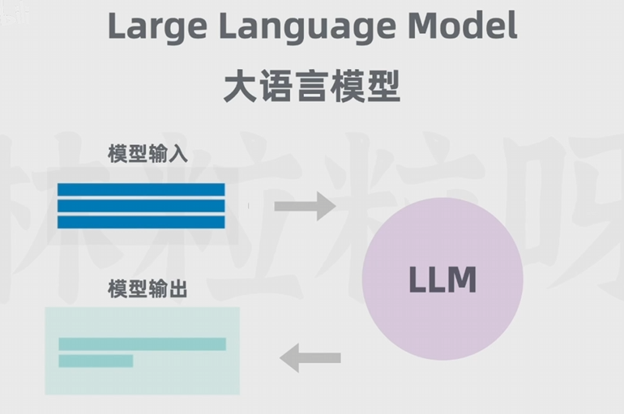

>  给模型一些文本类型输入 , 他会返回相应的文本输出 

它首先需要通过大量文本 , 进行 **无监督学习** , 借助海量的数据 , 模型能更多了解单词与上下文之间的关系 , 从而更好的理解文本的含义 , 并生成更准确的预测 .

但是大语言模型的大 , 不仅仅是训练数据的巨大 , 同样也是 参数 (模型内部的变量) 的巨大 , 参数决定了模型 如何对输入数据做出反应 , 从而决定了模型的行为 .

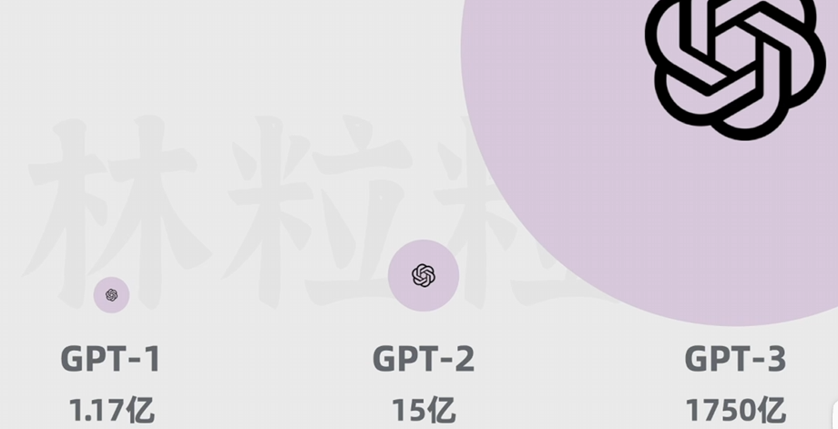

> 可以看到 ChatGPT 的参数 越来越多

大模型参数种类的繁多 , 也让大模型不像小模型一样只能局限于某一个单项 或 某几项任务 , 而是具有更加广泛的任务 .

#### GPT

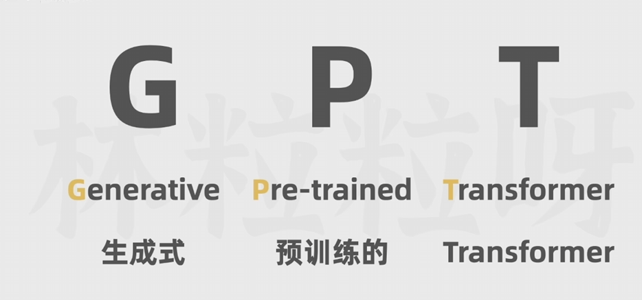

而大模型的里程碑之一 , 便是 Google 在 2017年的 [Attention Is All You Need][Attention Is All You Need] 这篇论文 , 提出了 Transformer 模型的概念 , 从而让各种大模型 雨后春笋 涌出来了 , 基于 Transformer 架构的模型 , 后续称之为 GPT .

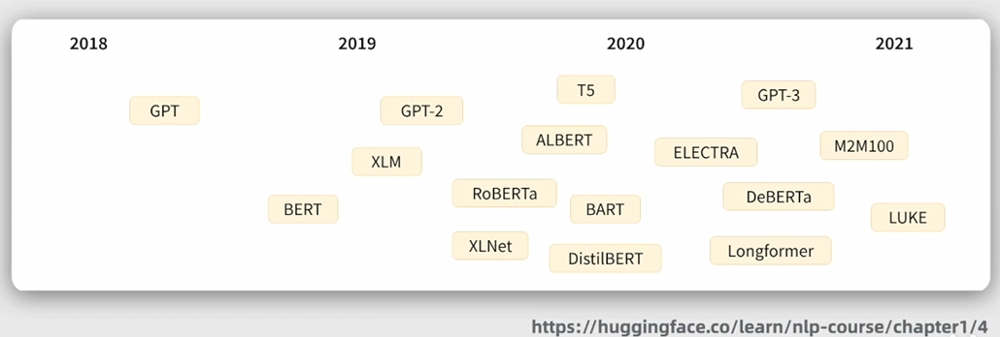

随后 Transformer 以及它的变体 , 便广泛应用再各个数据集上 来训练大语言模型了 .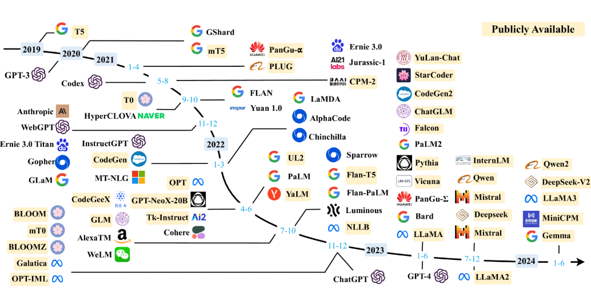

一直到2022年11月 ChatGPT 直接向用户开放 , 并且能在网页上丝滑的交互 , 这才真正走入公众的视野 , 也成功在 5天内 累计 100百万 线上用户 , 这也就是 我们所认识的 LLM . 

#### 传统的 RNN (循环神经) 架构

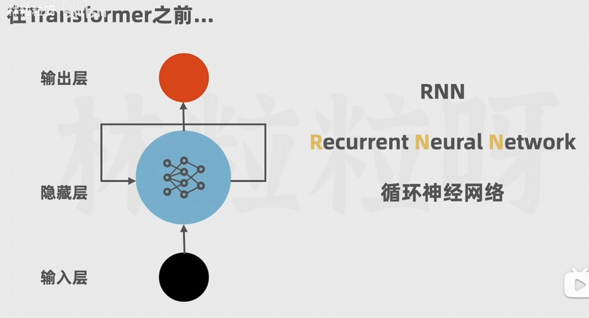

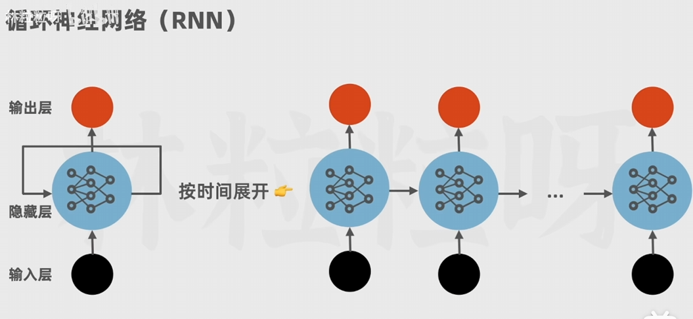

RNN (Recurrent Neural Networks) 架构按顺序逐次处理 , 每一次的输出取决于向前的 隐藏状态 和 当前的输入 , 也就是说要等上一步完成后 才能进行当前层的计算 , 下面便是 RNN 架构的缺点 :

- 无法并行计算
- 无法处理长文本 
- **层越多 , 前面的影响对后面的影响越弱**

> 因此当时 只能训练小型模型 , 并且 由于 无法并行计算的原因 , 模型的相应速度也很慢 

#### LSTM (长短期记忆网络) 架构

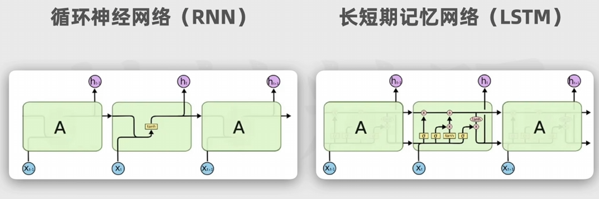

后续推出了 LSTM (Long Short-term Memory) 架构 , 通过每层不但处理当前层的数据 , 还会携带了靠前层的特征 , 这样 虽然解决了RNN 中 多层级后 越靠前的特征 影响越小 的问题 , 但是想要高效训练大量的数据 , 依旧有下列的困难 :

- 无法并行计算
- 无法处理长文本
> 依旧 只能训练小型模型 , 但是模型对特征的处理有明显改善

后面还有 GRU  (Gated Recurrent Unity) (门控循环单元网络) 架构 也是在 RNN 架构上的改良 , 用于处理序列数据 , 如自然语言处理和时间序列预测等任务 , GRU 和 LSTM 的主要区别在于它们的结构和门控机制 .

#### Transformer 架构

模型执行 [GIF](什么是LLM大语言模型.assets/Transformer架构.gif)

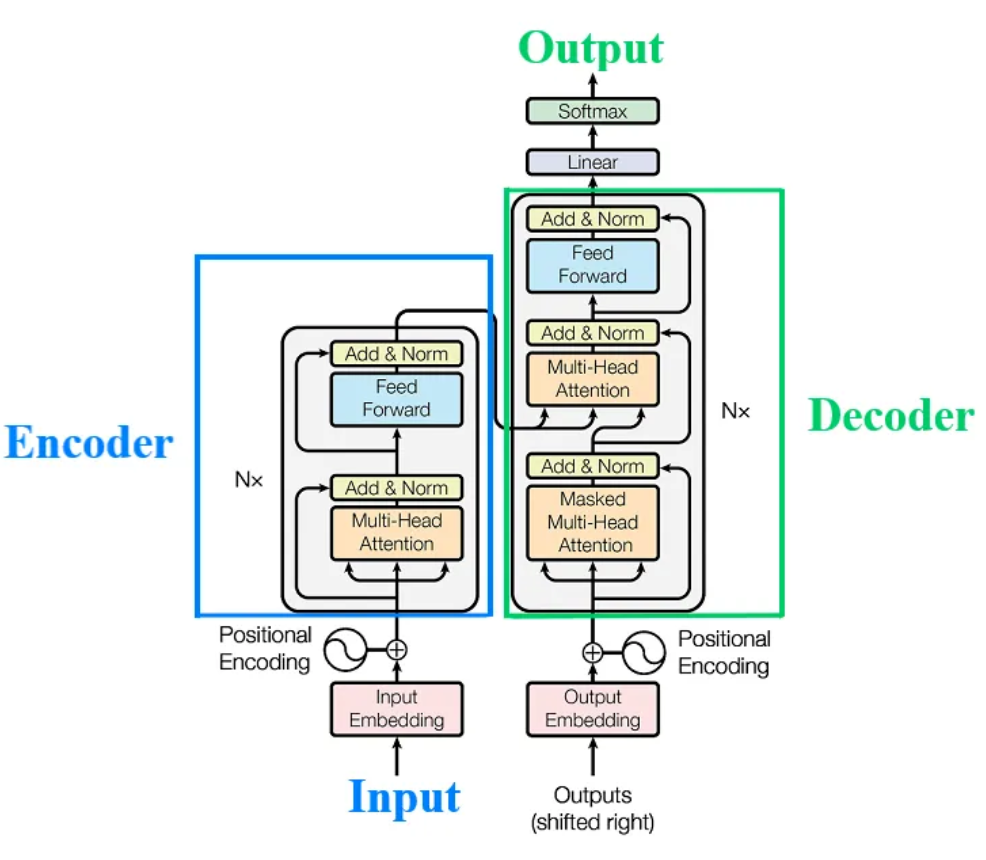

>**Transformer模型通过词嵌入、位置编码、多头注意力、残差连接和前馈网络等组件 **，实现了对输入序列的高效编码和输出序列的生成。
>
>Input Embedding : 编码器和解码器是Transformer模型的两个主要组件。编码器将输入序列（通常是单词序列）转换为词嵌入，并捕获其中的语义信息。解码器则使用这些信息来生成输出序列。在Transformer中，解码器的初始输入可能是一个特殊的起始标记或编码器的某些输出，而不是传统意义上的“输出集成”。 序列的顺序（句子中单词的位置）信息非常重要。由于没有循环（因为在RNN中，单词是一个接一个处理的，处理是顺序的，所以我们可以知道单词的位置，而Transformer是并行和非顺序的），这个序列中绝对（或相对）位置的信息是通过使用正弦/余弦“位置编码”来表示的。
>
>Positional Encoding : 由于Transformer模型是并行处理的，它不像RNN那样依赖顺序处理来捕捉位置信息。因此，需要添加位置编码来确保模型能够理解序列中单词的顺序。多头注意力方法允许从不同头计算和捕获相关信息，也就是说，输入句子中所有单词的注意力分数都被计算出来。
>
>Multi-Head Attention : 多头注意力是Transformer的一个关键组成部分，它允许模型同时关注输入序列中的多个不同位置。这有助于捕获更丰富的上下文信息。残差连接是将输入添加到子网输出以优化深度网络的一种简单方法，整个网络使用残差连接，并在层上应用加法和归一化（使用层归一化）。
>
>Add & Normal : 残差连接有助于解决深度神经网络在训练过程中的梯度消失或爆炸问题，从而提高模型的性能。掩蔽多头自注意力与多头注意力相同，但注意力仅针对输出句子、当前预测的单词以及输出句子的前一个单词进行计算（在RNN中，输出句子的单词是一个接一个预测的，这是解码器的本质）。这个将在后面详细解释。
>
>Feed Forward : 前馈网络增加了模型的非线性，有助于捕获更复杂的模式。在Transformer中，这些前馈网络被添加到多头注意力机制之后，进一步增强了模型的表示能力。
>
>Masked Multi-Head Attention : 这里描述的是解码器在生成输出序列时使用的自注意力机制的一个特定方面 ，即它如何关注当前预测的单词和之前已经生成的单词, 即在预测下一个词语时 , 只使用前面的词作为上下文 , 因此叫做 带掩码的多头自注意力。 编码器和解码器的每一层都包含一个全连接前馈网络（ffn）。这由两个线性变换组成，这两个变换之间有一个ReLU激活函数。在基本的Transformer中，输入和输出的维度是dmodel = 512，隐藏层的维度是dff = 2048。
>
>Linear & Softmax : 简单理解为 将解码器的输出表示 转换为词汇表的概率分布 , 这个词汇表的概率分布 , 代表了下一个被生成 Token 的概率 , 在大多数情况下 模型会选择 概率最高的 Token 做为概率输出

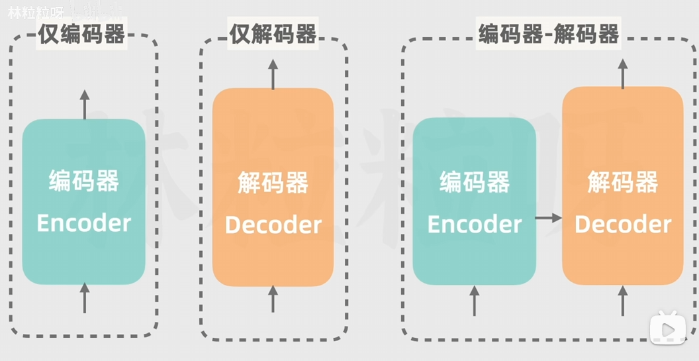

>仅编码器/自编码器模型 : Encoder-Only / Autoencoding Module , 例子是 BERT , 用例 : 掩码语言建模 , 情感分析
>
>仅解码器/自回归模型 : Decoder-Only / Autoregressive Model , 例子是 GPT-2 , GPT-3 , 用例 : 文本生成
>
>编码器-解码器/序列到序列的模型 : Encoder-Decoder / Sequence-To-Sequence Model , 例子是 T5 , BART , 用例 : 翻译 , 总结

这个时候 Transformer 出现了 , 主要是依赖于 [Attention Is All You Need][Attention Is All You Need] 这篇论文 , 它摒弃了传统的 循环 与 卷积 操作 , 而完全基于 **注意力机制**  , 以此使得模型更易于并行化 , 并且训练时间大大减少 , 与 **位置编码** , 

**Transformer创始八子：聚是一团火，散是满天星。**

- Jakob : 提出用自注意力机制替换 RNN的 想法 , 并开始评估 .
- Ashish 与 Illia : 设计并实现了第一个 Transformer模型 , 并在工作中发挥了关键作用 .
- Noam : 提出了缩放点积注意力、多头注意力和无参数位置表示 , 并深入参与工作细节 .
- Niki : 在原始代码库和 tensor2tensor 中设计、实现、调优和评估模型变体 .
- Llion : 尝试新型模型变体 , 负责初始代码库 , 以及高效推理和可视化 .
- Lukasz 和 Aidan : 设计和实现 tensor2tensor , 取代早期代码库 , 改进结果 , 加速研究 .

##### 自注意力机制
Transformer 中的层在处理这个 词 本身时 , 还会处理周围的词 以及 所有的词语 , 并且给予每个词 不一样的注意力权重 , 也就是说它每一层都有能力学习输入序列里 所有词的 **相关性** 和 **上下文** .
而每个词语对应的权重 , 是前期通过大量文本 训练习得的 , 因此 模型有能力知道 每个词之间的相关性有多强 , 然后去专注于输入里真正重要的部分 .

##### 位置编码

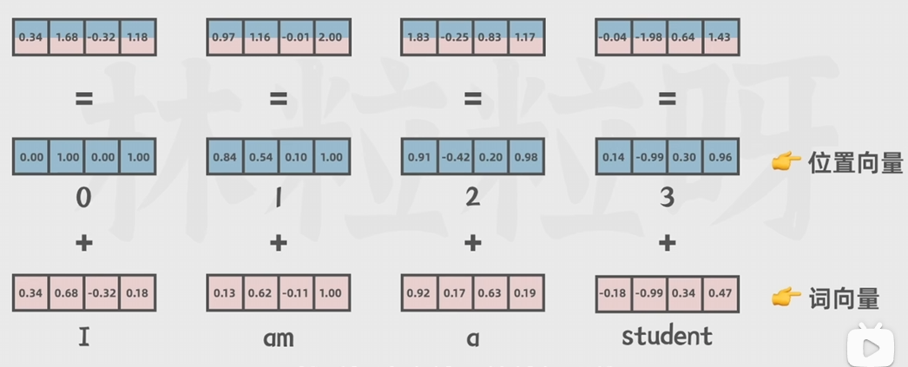

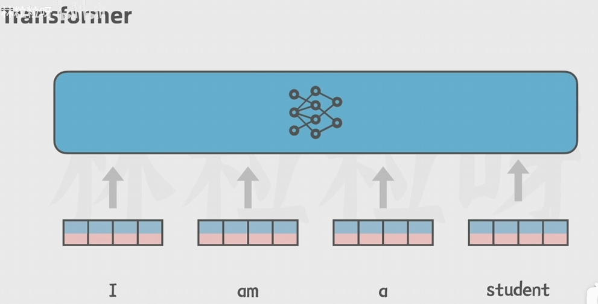

Transformer 的另一项创新是 位置编码 .
由于传统的架构式是 依次处理句子中的每个词 , 因此不能并行处理 , 必须等待上一层处理完毕后 , 才能处理当前层的数据 .
而 Transformer 通过添加了位置编码 , 将数据分成两部分 , 一部分是这个词本身 , 一部分是 这整个句子中每个词的位置 , 将他们合并并把这个结果给神经网络 , 这样 模型既可以理解每个词的意义 , 又能够捕获词在句子中的位置 , 从而理解不同词顺序的关系 , 因此借助位置编码 , 词 可以不按顺序的输入给 Transformer , 模型可以同时处理输入序列里的所有位置 , 那么在计算时 , 每个输出都可以独立计算 , 而不需要像 RNN 那样等待上一层算好后 再处理 .

基于上述两点 , 已经可以解决传统模型中 无法并行计算 与 无法处理长文本 的问题 , 从而使训练大数据量文本 与 长句子文本 变得没那么困难 , 因此以此为架构的 大预言模型 便得以落实 .

[Attention Is All You Need]: https://arxiv.org/abs/1706.03762	"Google Transormer 模型提出"
[A Survey of Large Language Models]: https://arxiv.org/abs/2303.18223v15	"大语言模型的调查"
[BILIBILI AL 大模型科普]: https://www.bilibili.com/video/BV12N411x7FL
[BILIBILI Transformer 架构解析]: https://www.bilibili.com/video/BV1ZG411y7aZ
[论文解析]: https://news.cafa.edu.cn/MobileNews/independenWeixinContent?contentId=225329199

